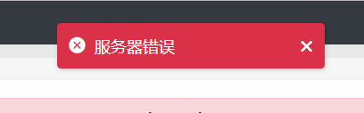
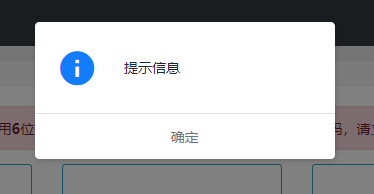
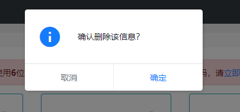
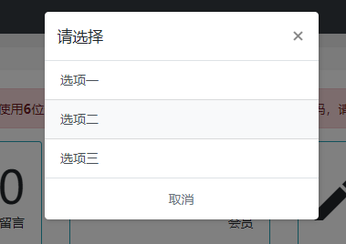
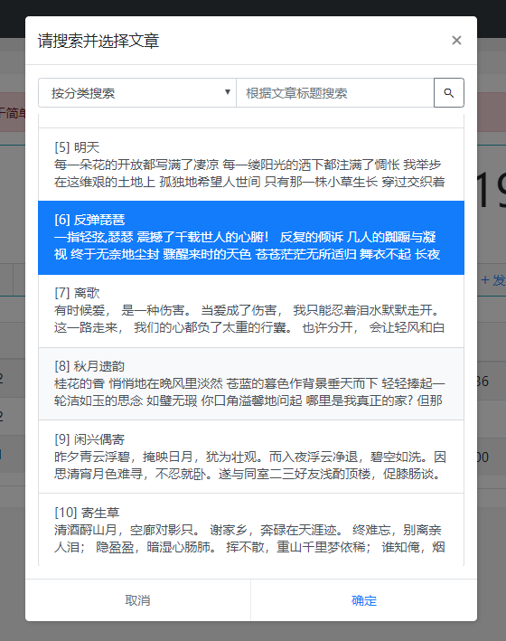
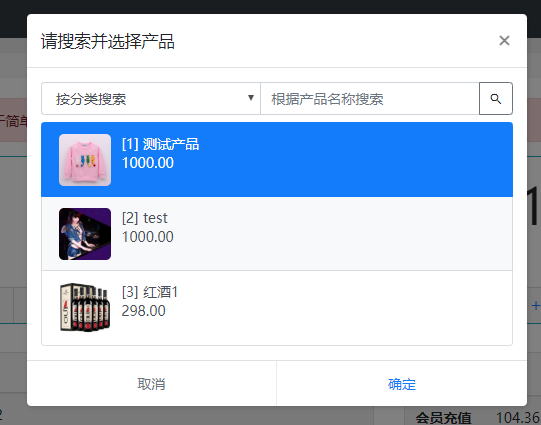
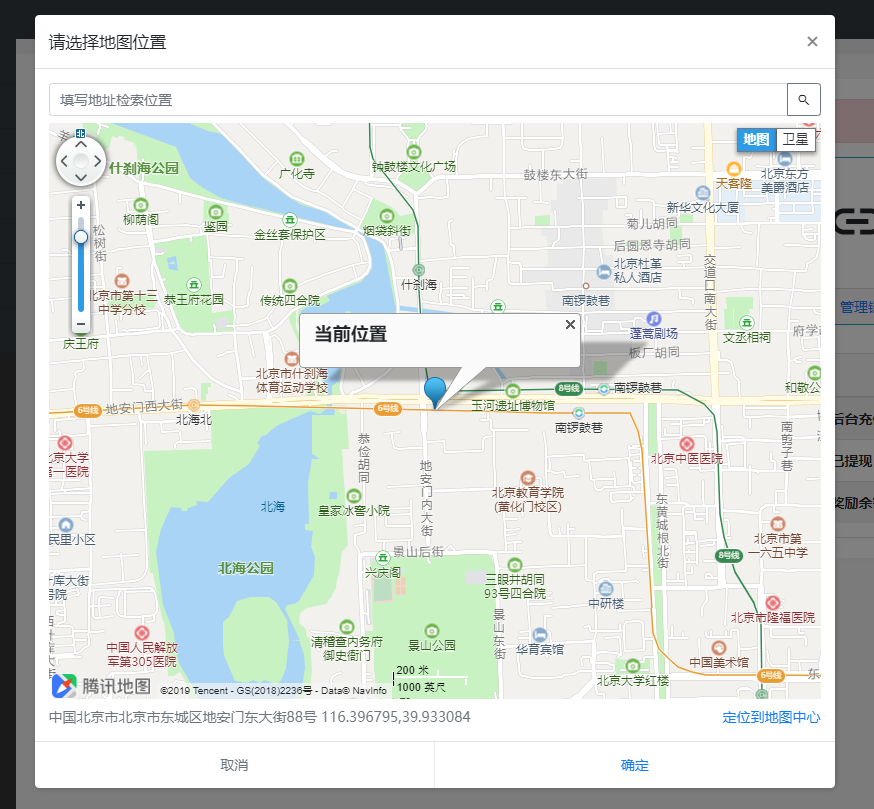

## Dialog

> 基于BootStrap4.x的弹出框库 

### 要解决的问题

> BootStrap 的弹框组件，要预先写好html代码在文档流中，实际调用时也不容易控制样式 
> 本组件基于bs的dialog组件，由js生成弹窗代码，灵活调用，不限层数（新调用的zindex更高）

### 效果展示

| | | |
|:---:|:---:|:---:|
||||
||||
||||

### 参数表

> 所有回调函数可以接收两个参数，一个弹框body的jQuery对象，一个弹框体的jQuery对象，并且函数绑定弹框对象本身

| 参数 | 类型  | 可选值   | 说明   |
|:-----:|:-----:|:-----:|:----- |
| size | string | sm/md/lg | 弹出框尺寸 |
| header | bool | true/false | 是否显示标题区 |
| footer | bool | true/false | 是否显示底部按钮区 传入空的按钮参数，会自动隐藏底部 |
| btns | array |  | 按钮设置 默认确定和取消两个按钮 |
|contentClass|string|  |内容区的额外css类|
| onsure | callback |  | 确认操作,默认按钮的回调函数 |
| onshow | callback |  | 显示回调 |
| onshown | callback |  | 显示完成回调 |
| onhide | callback |  | 关闭回调 return false 会阻止弹框关闭 |
| onhidden | callback |  | 关闭完成回调 |

> 按钮属性表

| 属性名 | 值类型 | 说明 |
|:---:|:---:|:--- |
| text | string | 按钮文字 |
| type | string | 按钮样式 可选值 primary/secondary/info/success/warning/danger |
| isdefault | bool | 是否默认 只能有一个默认按钮 |
| click | callback | 回调函数 默认按钮设置了回调函数，主参数中的onsure将不再调用 |

### 方法表

| 方法名   | 参数  | 说明   |
|:-----:|:-----:|:-----:|
| show | content,title | 显示弹框,content可以为html,title可省略 |
| hide | 无 | 隐藏弹框 |

### 快捷调用

> 快捷调用绑定在全局 dialog 对象上，所有方法均返回生成的弹框对象(Dialog),可调用close方法手动关闭

| 方法名   | 参数  | 说明   |
|:-----:|:-----:|:-----:|
| error | message\[,time\] | message的error类型 |
| success | message\[,time\] | message的success类型 |
| warning | message\[,time\] | message的warning类型 |
| info | message\[,time\] | message的info类型 |
| loading | message\[,time\] | message的loading类型 |
| message | message\[,type\[,time\]\] | 不带头部和按钮的提示框，类似toast |
| alert | message\[,callback\[,title\]\] | 提示框 |
| confirm | message\[,confirm\[,cancel\]\] | 确认框 |
| prompt | message,callback\[,cancel\] | 输入框 |
| action | list,callback\[,title\] | 操作选项 |
| pickList | config,callback\[,filter\] | 异步拉取列表数据选择 |
| pickUser | callback\[,filter\] | 检索并选择用户弹框 |
| pickArticle | callback\[,filter\] | 检索并选择文章弹框 |
| pickProduct | callback\[,filter\] | 检索并选择产品弹框 |
| pickLocate | type, callback, locate | 地图位置选择 |

> 快捷调用中的参数说明

| 参数名 | 参数类型 | 可选值 | 说明 |
|:-----:|:-----:|:-----:|:----- |
| message | string/html | | 提示框的内容 |
| time | int | | message提示停留时间，单位 秒 |
| type | string | | message提示中表示提示样式 |
| type | string | baidu/google/tencent/daode | 地图位置选择中表示地图类型 |
| callback | callable |  | 回调函数，在无需数据回调的方法中第一个参数为弹框的body元素  在需要数据的方法中回调第一个参数为数据 |
| config | object |  | 异步列表选择框的配置 具体参数作用参考pickList代码，及pickUser/Article 等方法中的示例 |
| filter | object |  | 额外的筛选项，用于传到搜索接口的额外参数 |

